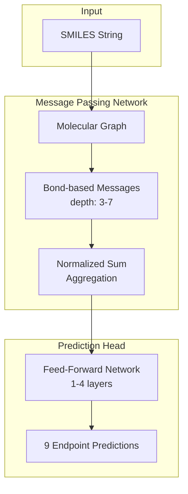
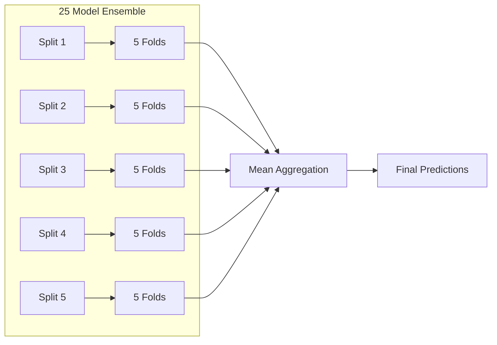

# Model Card: OpenADMET ExpansionRx Blind Challenge

## Table of Contents

- [Methodology Summary](#methodology-summary)
- [Model Overview](#model-overview)
- [Model Architecture](#model-architecture)
- [Training Performance](#training-performance-observations)
- [Hyperparameter Optimization](#hyperparameter-optimization)
- [Ensemble Strategy](#ensemble-strategy)
- [Evaluation](#evaluation)
- [Data Sources](#data-sources)
- [Known Limitations](#known-limitations)
- [Future Work](#future-work)
- [Reproducibility](#reproducibility)
- [References](#references)

---

## Methodology Summary

> **Challenge Requirements:** Model description, additional training steps, and performance observations.

### Model Description

Multi-task MPNN via [Chemprop v2](https://github.com/chemprop/chemprop) predicting 9 ADMET endpoints from SMILES. Ensemble of 25 models (5 Butina splits × 5 CV folds) with averaged predictions.


### Additional Training Steps

| Step | Description | Status |
|------|-------------|--------|
| HPO | Ray Tune ASHA ~2,000 trials | ✅ Used |
| Joint Sampling | Unified two-stage sampling via `JointSampler` | ✅ Used |
| FFN Variants | MLP, MoE, Branched architectures explored | ✅ Evaluated |
| Supplementary Data | KERMT, PharmaBench integration | 🔮 Future |

**Joint Sampling** combines:

- **Task Oversampling (Stage 1):** α-weighted inverse-power sampling for sparse endpoints
- **Curriculum Learning (Stage 2):** Quality-aware within-task sampling (warmup → expand → robust → polish)
  - *Note:* Curriculum learning was extensively evaluated but **abandoned** after ablation studies showed consistent performance degradation. See [Curriculum Learning Study](#curriculum-learning-study-negative-result) section below.

### Training Performance

- **Convergence:** 60–120 epochs with early stopping on validation MAE
- **Best validation MAE:** 0.4–0.6 (macro-averaged across endpoints)
- **R² range:** 0.40–0.85 (LogD best, Caco-2 and MGMB worst)

---

## Model Overview

- **Model Name:** OpenADMET Multi-Endpoint ADMET Predictor
- **Version:** 1.2.0

> **Note:** We implemented hyperparameter optimization (HPO) for single models and for ensembles, and added α-weighted oversampling to improve learning on sparser tasks in our multi-task models.

- **Task:** Multi-output regression for 9 ADMET endpoints
- **Architecture:** Chemprop MPNN ensemble
- **Training Framework:** PyTorch Lightning + Ray
- **Experiment Tracking:** MLflow

### Intended Use

Predict ADMET properties for small molecule drug candidates. Primary uses:

- Multi-endpoint ADMET prediction from SMILES
- Compound ranking by predicted profiles
- Identifying potential pharmacokinetic liabilities

**Out of scope:** Clinical decisions without validation, large biologics/polymers, regulatory submissions.

---

## Model Architecture

### Chemprop MPNN



| Component | Configuration |
|-----------|---------------|
| Message Passing Depth | 3–7 (HPO-tuned) |
| Message Hidden Dim | 700–1100 |
| FFN Layers | 1–4 |
| FFN Hidden Dim | 200–1200 |
| Dropout | 0.0–0.2 |
| Aggregation | Normalized sum |

### FFN Architectures Explored

Three FFN types were evaluated during HPO:

| Type | Description | Performance |
|------|-------------|-------------|
| **MLP** | Standard multi-layer perceptron | Best overall; used in final ensemble |
| **MoE** | Mixture of Experts with gating network | Competitive (rank 3, 7 in top-10) |
| **Branched** | Shared trunk + task-specific branches | Competitive (rank 5, 6, 10 in top-10) |

The MoE and Branched architectures are implemented in [`src/admet/model/chemprop/ffn.py`](src/admet/model/chemprop/ffn.py).

### CheMeleon Model

CheMeleon uses a pre-trained message passing encoder with a trainable FFN head:

- **Encoder:** Pre-trained Chemprop message passing network (frozen by default)
- **Checkpoint:** Auto-downloaded from Zenodo
- **FFN Head:** Supports all three architectures (MLP, MoE, Branched)
- **Transfer Learning:** Optionally unfreeze encoder for fine-tuning

CheMeleon and Chemprop share a unified FFN factory ([`src/admet/model/ffn_factory.py`](src/admet/model/ffn_factory.py)) for consistent architecture support.

### Multi-Task Learning

- **Output:** 9 endpoints predicted simultaneously
- **Loss:** Weighted MSE with NaN masking (missing endpoints ignored in gradient)
- **Task Weights:** Configurable per-endpoint weights (default: uniform 1.0)
- **Joint Sampling:** Unified `JointSampler` with two-stage algorithm:
  1. **Stage 1 (Task Selection):** Sample task `t` with probability `p_t ∝ count_t^(-α)` to balance sparse endpoints
  2. **Stage 2 (Within-Task):** Sample molecule from task's valid indices, weighted by curriculum phase

#### Weighted Multi-Task Loss Function

The total loss for a batch is computed as the weighted sum of per-task losses with NaN masking:

$$\mathcal{L}_{\text{total}} = \sum_{t=1}^{T} w_t \cdot \mathcal{L}_t$$

where:

- $T = 9$ (number of ADMET endpoints)
- $w_t$ = weight for task $t$ (configurable via `target_weights`)
- $\mathcal{L}_t$ = masked MSE loss for task $t$

**Per-Task Masked MSE Loss:**

$$\mathcal{L}_t = \frac{1}{|M_t|} \sum_{i \in M_t} (y_i^{(t)} - \hat{y}_i^{(t)})^2$$

where:

- $M_t$ = set of samples with valid (non-NaN) labels for task $t$
- $y_i^{(t)}$ = true label for sample $i$, task $t$
- $\hat{y}_i^{(t)}$ = predicted value for sample $i$, task $t$

**NaN Masking:** Samples with missing labels for a given task are excluded from that task's loss computation, allowing the model to learn from partial labels without requiring complete annotations.

#### Task Weight Strategy

| Strategy | Configuration | Use Case |
|----------|---------------|----------|
| **Uniform** | `target_weights: [1.0, ...]` | Default; equal importance for all endpoints |
| **Inverse Frequency** | $w_t \propto 1/count_t$ | Upweight rare endpoints |
| **Performance-Based** | $w_t \propto 1/MAE_t$ | Focus on underperforming tasks |
| **HPO-Optimized** | Search over weight space | Find optimal balance (future work) |

**Current Production Configuration:**

```yaml
target_weights:
  - 1.0  # LogD
  - 1.0  # Log KSOL
  - 1.0  # Log HLM CLint
  - 1.0  # Log MLM CLint
  - 1.0  # Log Caco-2 Permeability Papp A>B
  - 1.0  # Log Caco-2 Permeability Efflux
  - 1.0  # Log MPPB
  - 1.0  # Log MBPB
  - 1.0  # Log MGMB
```

**Note:** While the loss function supports non-uniform weights, the final production models use uniform weighting. Task-specific loss weighting is complementary to (not a replacement for) task oversampling—the former adjusts gradient magnitudes while the latter controls sampling frequency

---

## Data Sources

### Primary Dataset: ExpansionRx Challenge Data

- **Source:** OpenADMET ExpansionRx Blind Challenge
- **Quality Designation:** **High**
- **Description:** Curated ADMET data from the challenge organizers with standardized assay protocols
- **Size:** Primary training set with all 9 endpoints
- **Local Test Set:** 12% of ExpansionRx data withheld via temporal split on `Molecule Name` column (sorted alphabetically, last 12% held out). Used only during HPO and architecture evaluation; final models trained on full 5×5 CV without separate time split.

### Supplementary Dataset: KERMT Public

- **Source:** KERMT benchmark (public subset)
- **Quality Designation:** **Medium**
- **Endpoints Available:**
  - LogD (pH 7.4)
  - Kinetic Solubility (log Saq → converted to μM)
  - HLM/MLM Clearance
  - Caco-2 Permeability (Papp)
  - Rat Plasma Protein Binding
  - P-gp Efflux (human) → mapped to Caco-2 Efflux (low confidence)

### Supplementary Dataset: KERMT Biogen

- **Source:** KERMT benchmark (Biogen proprietary subset, publicly released)
- **Quality Designation:** **Low to Medium** (endpoint-dependent)
- **Endpoints Available:**
  - Solubility at pH 6.8 (different assay conditions than challenge)
  - MDR1-MDCK Efflux Ratio (MDCK cells, not Caco-2)
  - HLM CLint
  - Rat Plasma Protein Binding
- **Caveats:**
  - Solubility measured at pH 6.8 vs pH 7.0-7.4 in challenge data
  - Efflux measured in MDCK cells vs Caco-2 cells

### Supplementary Dataset: PharmaBench

- **Source:** PharmaBench benchmark collection
- **Quality Designation:** **Low to Medium** (endpoint-dependent)
- **Endpoints Available:**
  - LogD
  - Water Solubility
  - HLM/MLM Clearance
  - Plasma Protein Binding
- **Filtering Applied:**
  - MW > 1000 Da: excluded
  - LogP < -2 or LogP > 8: excluded
  - Rotatable bonds > 20: excluded

---

## Data Harmonization and Transformations

### Unit Harmonization

All datasets were transformed to common units before merging:

| Endpoint | Final Units | Storage Format |
|----------|-------------|----------------|
| LogD | dimensionless | Linear (untransformed) |
| KSOL (Kinetic Solubility) | μM | log₁₀(μM) |
| HLM CLint | mL/min/kg | log₁₀(mL/min/kg) |
| MLM CLint | mL/min/kg | log₁₀(mL/min/kg) |
| Caco-2 Papp A→B | 10⁻⁶ cm/s | log₁₀(10⁻⁶ cm/s) |
| Caco-2 Efflux Ratio | dimensionless | log₁₀(ratio) |
| MPPB (Mouse PPB) | % unbound | log₁₀(% unbound) |
| MBPB (Mouse Brain) | % unbound | log₁₀(% unbound) |
| MGMB (Mouse Gut Microbiome) | % unbound | log₁₀(% unbound) |

### Source-Specific Transformations

#### KERMT Public

| Source Column | Transformation | Target Column |
|---------------|----------------|---------------|
| `LogD_pH_7.4` | Identity | LogD |
| `kinetic_logSaq` (log M) | 10^(x+6) | KSOL (μM) |
| `CL_microsome_human` (log mL/min/kg) | 10^x × 10⁻³ | HLM CLint |
| `CL_microsome_mouse` (log mL/min/kg) | 10^x × 10⁻³ | MLM CLint |
| `Papp_Caco2` (log 10⁻⁶ cm/s) | 10^x | Caco-2 Papp |
| `Rat_fraction_unbound_plasma` (log %) | 10^x | MPPB |
| `Pgp_human` (log ratio) | 10^x | Caco-2 Efflux* |

*Low confidence mapping: P-gp efflux ≠ Caco-2 efflux ratio

#### KERMT Biogen

| Source Column | Transformation | Target Column |
|---------------|----------------|---------------|
| `SOLY_6.8` (μg/mL) | (x / MW) × 10³ | KSOL (μM)* |
| `MDR1-MDCK_ER` | Identity | Caco-2 Efflux* |
| `HLM_CLint` (log) | 10^x | HLM CLint |
| `Rat_fraction_unbound_plasma` (log %) | 10^x | MPPB |

*Caveats: Different assay conditions (pH 6.8 vs 7.0-7.4; MDCK vs Caco-2)

#### PharmaBench

| Source Column | Transformation | Target Column |
|---------------|----------------|---------------|
| `logd_reg` | Identity | LogD |
| `water_sol_reg` (log nM) | 10^x / 1000 | KSOL (μM) |
| `hum_mic_cl_reg` (log mL/min/g) | 10^x | HLM CLint |
| `mou_mic_cl_reg` (log mL/min/g) | 10^x | MLM CLint |
| `ppb_reg` (%) | Identity | MPPB |

### Post-Transformation Processing

1. **Log₁₀ Transformation:** All endpoints except LogD are stored as log₁₀ values
2. **Outlier Handling:** For binding/clearance endpoints (MPPB, MBPB, MGMB, HLM CLint, MLM CLint), values below -3.0 (log scale) are set to NaN as likely measurement artifacts
3. **SMILES Canonicalization:** All SMILES canonicalized with RDKit (isomeric=True, canonical=True) using [`src/admet/data/smiles.py`](src/admet/data/smiles.py):
   - **Salt Removal:** RDKit SaltRemover strips counter-ions while preserving the parent molecule
   - **Validation:** Invalid SMILES that fail parsing return None and are excluded
   - **Empty Check:** Molecules with zero atoms after salt removal are excluded
   - **Parallel Processing:** Thread pool (max 32 workers) for batch canonicalization
4. **Duplicate Handling:** Duplicate canonical SMILES within datasets averaged (excluding NaN)

---

## Quality Categorization

### Quality Tiers

Data quality is assigned per-endpoint based on:

1. **Assay protocol alignment** with challenge data
2. **Measurement conditions** (pH, cell type, species)
3. **Distribution overlap** with ExpansionRx data

| Dataset | LogD | KSOL | HLM CLint | MLM CLint | Caco-2 Papp | Caco-2 Efflux | MPPB | MBPB | MGMB |
|---------|------|------|-----------|-----------|-------------|---------------|------|------|------|
| ExpansionRx | High | High | High | High | High | High | High | High | High |
| KERMT Public | Medium | Medium | Medium | Medium | Medium | Medium | Low | — | — |
| KERMT Biogen | — | Low | Low | — | — | Medium | Medium | — | — |
| PharmaBench | Medium | Low | Medium | Medium | — | — | Low | — | — |

### Quality Rationale

- **High:** ExpansionRx challenge data with standardized protocols
- **Medium:** Comparable assay conditions, similar value distributions
- **Low:** Different assay conditions, protocol mismatches, or distribution shifts
- **—:** Endpoint not available in dataset

---

## Training Performance Observations

### Convergence Behavior

- **Typical convergence:** 60–120 epochs with early stopping on validation MAE
- **Early stopping patience:** 15 epochs without improvement
- **Learning rate:** OneCycleLR with warmup critical for stability

### Validation Performance

| Endpoint Category | Typical R² | Notes |
|-------------------|------------|-------|
| LogD | >0.85 | Well-represented, easiest |
| KSOL, HLM/MLM CLint | 0.65–0.75 | Good coverage |
| Caco-2 Papp/Efflux, MPPB | 0.55–0.70 | Moderate |
| MBPB, MGMB | 0.40–0.60 | Sparse, ExpansionRx only |

### Challenge Test Set Performance

Blind test evaluation revealed:

- **Overall Performance:** 10th/356 (Top 2.8%) as of 2026-01-16 with MA-RAE 0.56 ± 0.02. Strong correlation metrics across endpoints.
- **Strengths:** Solubility (KSOL) and binding endpoints (MGMB) showed excellent performance, maintaining strong R² and rank correlation
- **Areas for Improvement:** Permeability endpoints (Caco-2 Papp/Efflux) and certain binding tasks (MPPB, MBPB) showed larger gaps to top performers
- **Generalization:** Models demonstrated reasonable generalization from validation to blind test, with correlation metrics remaining robust
- **Task Heterogeneity:** Performance varied significantly by endpoint, suggesting task-specific modeling improvements could yield substantial gains

---

## Evaluation

### Challenge Results (January 6, 2026)

**Overall Performance:**

| Metric | Value | Rank | Notes |
|--------|-------|------|-------|
| MA-RAE | 0.61 ± 0.03 | 31/289 | Top 10.7% |
| R² | 0.53 ± 0.04 | — | — |
| Spearman R | 0.76 ± 0.02 | — | — |
| Kendall's Tau | 0.59 ± 0.02 | — | — |

**Per-Endpoint Performance:**

| Endpoint | Rank | MAE | Δ to Min (%) | R² | Spearman R | Kendall's Tau | Performance Tier |
|----------|------|-----|--------------|-----|------------|---------------|------------------|
| LogD | 63/289 | 0.35 ± 0.01 | 28.6% | 0.72 ± 0.03 | 0.88 ± 0.01 | 0.74 ± 0.01 | Needs Improvement (21.8%) |
| KSOL | 17/289 | 0.34 ± 0.01 | 8.8% | 0.62 ± 0.02 | 0.72 ± 0.02 | 0.53 ± 0.01 | Good (5.9%) |
| MLM CLint | 39/289 | 0.36 ± 0.01 | 11.1% | 0.41 ± 0.03 | 0.59 ± 0.03 | 0.42 ± 0.02 | Okay (13.5%) |
| HLM CLint | 35/289 | 0.30 ± 0.01 | 10.0% | 0.37 ± 0.05 | 0.61 ± 0.04 | 0.45 ± 0.03 | Okay (12.1%) |
| Caco-2 Efflux | 98/289 | 0.35 ± 0.01 | 25.7% | 0.19 ± 0.04 | 0.79 ± 0.01 | 0.58 ± 0.01 | Needs Improvement (33.9%) |
| Caco-2 Papp A>B | 70/289 | 0.25 ± 0.01 | 24.0% | 0.36 ± 0.04 | 0.74 ± 0.02 | 0.55 ± 0.02 | Needs Improvement (24.2%) |
| MPPB | 47/289 | 0.19 ± 0.01 | 26.3% | 0.66 ± 0.03 | 0.84 ± 0.02 | 0.65 ± 0.02 | Poor (16.3%) |
| MBPB | 65/289 | 0.16 ± 0.01 | 31.2% | 0.74 ± 0.03 | 0.87 ± 0.02 | 0.70 ± 0.02 | Needs Improvement (22.5%) |
| MGMB | 18/289 | 0.17 ± 0.01 | 11.8% | 0.69 ± 0.05 | 0.83 ± 0.03 | 0.67 ± 0.03 | Good (6.2%) |

**Key Observations:**

- **Top Performers:** KSOL (rank 17) and MGMB (rank 18) achieved top 6-7% placement
- **Competitive:** HLM CLint (rank 35) and MLM CLint (rank 39) in top 12-14%
- **Improvement Opportunities:** Permeability tasks (Caco-2 Efflux rank 98, Papp rank 70) and plasma/brain binding (MPPB rank 47, MBPB rank 65) show largest gaps to leaders
- **Correlation Strength:** High Spearman R (0.72-0.88) across all tasks indicates strong rank ordering despite MAE gaps

---

## Hyperparameter Optimization

### Framework

- **Tool:** Ray Tune with ASHA scheduler
- **Trials:** ~500
- **Objective:** Validation MAE (minimize)
- **Early stopping:** Grace period 10 epochs, reduction factor 2
- **Evaluation Split:** Local test set (12% temporal holdout) used during HPO to prevent overfitting to validation folds

### Search Space Summary

| Parameter | Range |
|-----------|-------|
| `learning_rate` | [1×10⁻⁴, 3×10⁻²] log-uniform |
| `depth` | [2, 8] |
| `message_hidden_dim` | {200, ..., 1200} |
| `ffn_type` | {mlp, moe, branched} |
| `ffn_num_layers` | [0, 5] |
| `dropout` | {0.0, ..., 0.3} |
| `task_sampling_alpha` | {0.0, ..., 1.0} |

### Top 10 Configurations

| Rank | FFN | Depth | Msg Dim | FFN Layers | FFN Dim | Dropout | α | LR | Val MAE |
|------|-----|-------|---------|------------|---------|---------|---|-----|---------|
| 1 | MLP | 3 | 700 | 4 | 200 | 0.15 | 0.02 | 2.27e-4 | 0.459 |
| 2 | MLP | 4 | 1100 | 1 | 1200 | 0.10 | 0.20 | 1.19e-3 | 0.460 |
| 3 | MoE | 6 | 1100 | 2 | 1100 | 0.00 | 0.00 | 2.94e-3 | 0.461 |
| 4 | MLP | 6 | 1000 | 3 | 700 | 0.20 | 0.20 | 1.77e-3 | 0.462 |
| 5 | Branched | 4 | 900 | 3 | 400 | 0.10 | 0.00 | 3.04e-4 | 0.463 |
| 6 | Branched | 5 | 800 | 2 | 800 | 0.05 | 0.05 | 2.74e-4 | 0.464 |
| 7 | MoE | 6 | 700 | 4 | 300 | 0.05 | 0.02 | 5.24e-4 | 0.464 |
| 8 | MLP | 3 | 1000 | 4 | 400 | 0.10 | 0.10 | 2.60e-4 | 0.465 |
| 9 | MLP | 4 | 800 | 2 | 1100 | 0.20 | 0.20 | 2.12e-3 | 0.467 |
| 10 | Branched | 7 | 700 | 4 | 800 | 0.15 | 0.02 | 2.41e-4 | 0.468 |

**Key insights:**

- MLP architectures dominate top ranks but MoE/Branched are competitive
- Task sampling α = 0.02–0.2 appears optimal
- Moderate dropout (0.05–0.15) preferred
- Deeper message passing (4–7) with moderate dimensions (700–1100)

### Joint Sampling Strategy

**Purpose:** Unified sampling combining task-aware oversampling with curriculum learning via the `JointSampler` class.

**Two-Stage Algorithm:**

1. **Stage 1 (Task Selection):** Sample task `t` with probability:
   $$p_t \propto count_t^{-\alpha}$$
   where `count_t` = samples with labels for task `t`

2. **Stage 2 (Within-Task):** Sample molecule from task's indices, weighted by curriculum phase proportions

**Task Sampling Alpha (`task_oversampling.alpha`):**

| α Value | Effect |
|---------|--------|
| 0.0 | Uniform task sampling (no rebalancing) |
| 0.02–0.1 | Mild rebalancing (recommended; used in top configs) |
| 0.5–1.0 | Aggressive; may hurt overall MAE |

**Configuration:**

```yaml
joint_sampling:
  enabled: true
  task_oversampling:
    alpha: 0.02  # Mild rebalancing for sparse endpoints
  curriculum:
    enabled: false  # Not used in final production model
```

**Note:** Curriculum learning was extensively evaluated during HPO, but the best-performing models used only task oversampling (α = 0.02).

---

## Ensemble Strategy

### Configuration

- **Splits:** 5 Butina clustering splits
- **Folds:** 5-fold CV per split
- **Total models:** 25
- **Clustering:** Taylor-Butina on molecular fingerprints
- **Training Strategy:** HPO and architecture evaluation used 88% of data (12% temporal holdout); final ensemble trained on full dataset with 5×5 CV



### Prediction Aggregation

```text
Y_mean = mean(Y_pred across 25 models)
Y_std = std(Y_pred across 25 models)
```

---

## Curriculum Learning Study (Negative Result)

### Summary

We conducted a comprehensive ablation study to evaluate curriculum learning for leveraging external ADMET datasets of varying quality. **All experiments showed significant performance degradation compared to the base model.**

| Experiment | Test MAE | Test R² | vs Base MAE |
|------------|----------|---------|-------------|
| **Base Model (High-Quality Only)** | **0.307** | **0.582** | — |
| 01 Baseline Curriculum | 0.385 | 0.297 | +25.4% worse |
| 02 Two-Quality Only | 0.355 | 0.407 | +15.7% worse |
| 03 Selective Tasks (Loss Weighting) | 0.378 | 0.334 | +23.2% worse |
| 04 High-Quality Focus | 0.381 | 0.317 | +24.0% worse |
| 05 Finetune Approach | 0.372 | 0.339 | +21.2% worse |

### Key Findings

1. **Catastrophic forgetting** on 3 endpoints (Caco-2 Papp, Caco-2 Efflux, MGMB) — R² dropped from positive to negative
2. **Extreme data sparsity** in external datasets (>90% missing for most endpoints) disrupted multi-task learning
3. **Distribution shift** between high-quality and external data sources compounded the problem
4. **None of the mitigations tested** (excluding low-quality data, loss weighting, HQ monitoring, fine-tuning) recovered base model performance

### Recommendation

**Abandon curriculum learning with current external datasets.** The data quality and coverage issues cause more harm than benefit. Future work should focus on:

- Data-centric improvements (quality filtering, distribution alignment)
- Per-endpoint curriculum enabling only for well-covered endpoints
- Alternative approaches like self-training with pseudo-labels

Full analysis: [`assets/analysis/curriculum-learning/CURRICULUM_LEARNING_ANALYSIS.md`](assets/analysis/curriculum-learning/CURRICULUM_LEARNING_ANALYSIS.md)

---

## Known Limitations

### Data Harmonization Caveats (Future Work)

> **Note:** Supplementary data integration was evaluated but not used in the final submission.

1. **Assay Condition Mismatches:**
   - KERMT Biogen solubility at pH 6.8 vs challenge pH ~7.0-7.4
   - KERMT Biogen efflux from MDCK cells vs Caco-2 cells
   - P-gp efflux (KERMT Public) ≠ Caco-2 efflux ratio

2. **Species Differences:** MPPB uses rat in some datasets, mouse in others

### Model Limitations

- **Domain:** Trained on drug-like small molecules; may not generalize to natural products, peptides, PROTACs
- **Sparse Endpoints:** MBPB/MGMB rely solely on ExpansionRx data
- **No Calibrated Uncertainty:** Ensemble stderr is spread, not confidence intervals
- **Uniform Task Weights:** Loss function uses equal weighting (1.0) for all endpoints; task sampling alpha compensates but per-endpoint loss weighting could improve performance

---

## Future Work

| Feature | Description | Status |
|---------|-------------|--------|
| Supplementary Data | KERMT, PharmaBench integration with harmonization | ✅ Evaluated |
| Joint Sampling | Unified `JointSampler` with two-stage algorithm | ✅ Evaluated |
| Alternative Models | XGBoost, LightGBM, CheMeleon ensemble | ✅ Implemented |
| Uncertainty | Conformal prediction, Bayesian methods | 🔮 Planned |
| Task Weights | HPO-optimized per-endpoint loss weights (currently uniform) |  ✅ Evaluated |

---

## Reproducibility

### Random Seeds

- Base seed: 12345
- Per-fold seeds: base_seed + fold_index

### Environment

| Package | Version |
|---------|---------|
| Python | 3.11 |
| PyTorch | ≥2.1 |
| Chemprop | ≥2.0 |
| Ray | ≥2.4 |
| MLflow | ≥2.0 |

### Artifacts Logged

- Model checkpoints (best validation loss)
- Training metrics (per epoch)
- Predictions (train/val/test in log and linear space)
- Configuration YAML
- Run metadata (git hash, library versions)

---

## References

- [Chemprop](https://github.com/chemprop/chemprop): Message-passing neural networks for molecular property prediction
- [KERMT Benchmark](https://github.com/ncats/kermt): ADMET benchmark datasets
- [PharmaBench](https://github.com/mims-harvard/TDC): Therapeutics Data Commons benchmarks
- [Ray Tune](https://docs.ray.io/en/latest/tune/): Distributed hyperparameter tuning
- [BitBirch](https://github.com/jwildenhain/bitbirch): Scalable hierarchical molecular clustering

---

## Contact

**Repository:** [OpenADMET-ExpansionRx-Blind-Challenge](https://github.com/alec-glisman/OpenADMET-ExpansionRx-Blind-Challenge)
**Author:** Alec Glisman